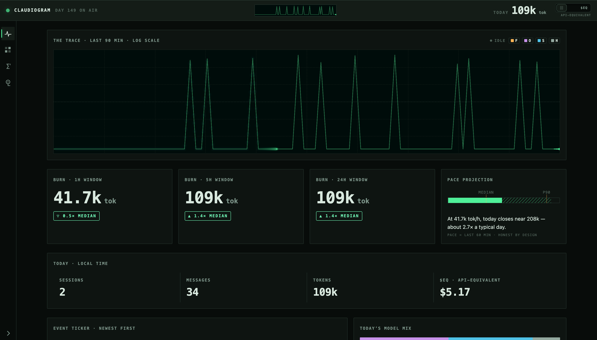
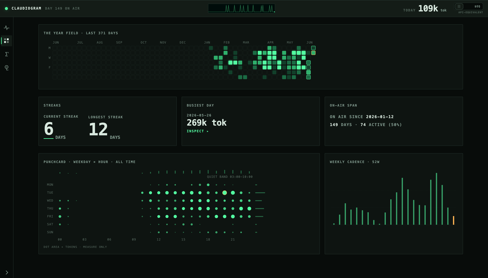
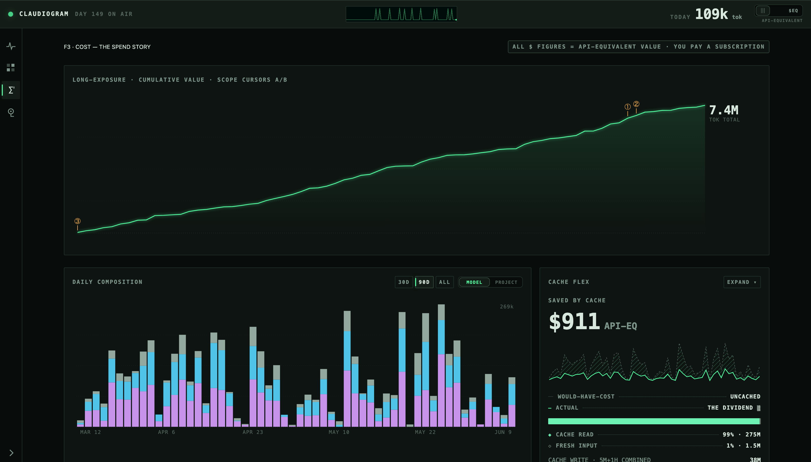
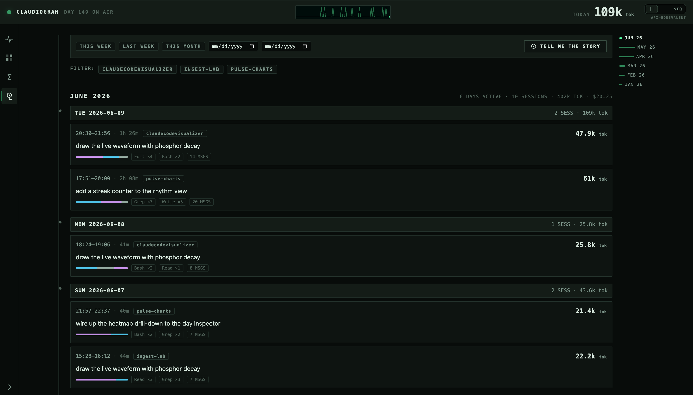

<div align="center">


# Claudiogram

### Your Claude Code usage is a story. Watch it beat.

A personal observatory for everything Claude Code does for you — a **live token
pulse**, a year of **work-rhythm heatmaps**, the full **cost story**, and a
**time capsule** of every session you've ever run. All on your machine. All
counted correctly.

[](https://github.com/singhpratech/Claudiogram/actions/workflows/test.yml)


**Zero npm dependencies · Zero telemetry · Zero writes outside its own folder**



</div>

---

## The numbers you've seen are probably wrong

Claude Code quietly writes a transcript of every session to
`~/.claude/projects/` — every token, every tool call, every late-night sprint.
But here's the catch most tools miss:

> **Claude Code writes one JSONL line per content block.** A single API
> response repeats the same `message.id` and the same `usage` payload across
> many lines. Sum them naively and you inflate your totals **~2.3×** on real
> data.

Claudiogram dedupes at the database layer, prices your true usage at API list
rates, and renders it as a live phosphor-green instrument panel — so the number
you screenshot is a number you can defend.

## Sixty seconds to your first heartbeat

```bash
git clone https://github.com/singhpratech/Claudiogram.git
cd Claudiogram
node server.js          # → http://localhost:4242
```

That's the whole install. No `npm install` — there is nothing to install.
Requires [Node.js](https://nodejs.org) ≥ 22.5 (uses the built-in `node:sqlite`).

No git? Grab a ready-made bundle from the
[**latest release**](https://github.com/singhpratech/Claudiogram/releases/latest)
(SHA-256 checksums included). Prefer a double-click? Every platform gets a real
launcher:

| Platform | Launcher |
|----------|----------|
| macOS    | **`Claudiogram.app`** — drag it to the Dock (keep it inside this folder). First launch: right-click → **Open** (the app is unsigned, Gatekeeper asks once) |
| Windows  | **`Claudiogram.bat`** — run `powershell -ExecutionPolicy Bypass -File scripts\make-shortcut.ps1` once for a Desktop shortcut with the app icon and no console window |
| Linux    | **`claudiogram.sh`** — run `sh scripts/make-desktop.sh` once to install a per-user app-menu entry with the icon (no root; uninstall = delete two files, the script prints them) |

The macOS launcher hunts for Node beyond the PATH (Homebrew, nvm, volta, fnm,
asdf, n); Windows and Linux use your PATH. All three gate on the version,
survive install paths with spaces, and reuse an already-running server.
`PORT=xxxx` changes the port (`CLAUDIOGRAM_PORT` for the launchers).
Windows needs build 1803+ (built-in `curl`). The server binds **127.0.0.1
only** — nobody on your network can see it (set `HOST=0.0.0.0` if you
explicitly want LAN access).

## The four instruments

### F1 · PULSE — see your tokens land, live

An ECG for your AI. The trace above beats in real time — fed over SSE the
moment Claude Code writes a line, in any project, in any terminal. Burn
windows for the last 1h/5h/24h against your typical day, plus an honest pace
projection for where today is heading.

### F2 · RHYTHM — when you actually work

A GitHub-style heatmap of the last 371 days, streak odometers, and an
hour-by-weekday punchcard that knows about your quiet hours. The late-night
sprints you forgot about are all here.



### F3 · COST — the spend story

Cumulative API-equivalent value with **draggable scope cursors** — measure
Δ$ / Δtokens between any two dates. Daily composition stacked by model or
project. And the cache flex: what prompt caching saved you versus the
uncached would-have-cost.



### F4 · CAPSULE — every session you've ever run

Newest first: the prompt that started it, how long it ran, the tools it used,
the model mix. Claude Code prunes old transcripts (30 days by default) —
**Claudiogram remembers everything it has ever ingested.** The **TELL ME THE STORY** key asks `claude -p` (your own
subscription, only on click, cached after) to narrate any period of your work.



**Drill-down everywhere:** click any heatmap day, bar, or curve point → Day
Inspector drawer (hourly bars, projects, models, sessions; arrow keys walk
days). Click any project → project view. Click any session → full detail. The
header latch (or `m`) flips every chart between **tokens ⇄ $EQ**.

> **About the dollars:** all figures are **API-equivalent value** — what your
> usage would have cost at API list prices. On a subscription you didn't pay
> this; it's the flex, not a bill.

## Why this and not a CLI report?

| | **Claudiogram** | Typical usage tools |
|---|---|---|
| Counting | Once per `message.id`, enforced in SQL | Often naive line sums (~2.3× inflated) |
| Freshness | **Live** — SSE pulse the moment a line lands | Run a command, read a table |
| History | Keeps everything ever ingested, forever | Limited to surviving transcripts (~30 days) |
| Dependencies | **Zero.** Built-in `node:sqlite`, hand-rolled charts | `node_modules`, chart libs — a bigger supply-chain surface |
| Your transcripts | Read-only — **proven by the test suite** | A promise, at best |
| Network | None. No CDN, no fonts, no calls home | Varies |

## Your data never leaves. Provably.

Claudiogram **never writes to `~/.claude`**. Transcripts are opened with
read-only flags; the only thing the app ever writes is its own `data/` folder.
This isn't a promise — it's a test: the suite ingests write-protected
(chmod 444) fixtures and verifies **byte-identical checksums**, identical
directory listings, and unchanged permissions afterward.

```bash
npm test    # 11 tests, sandboxed — never touches your real DB or transcripts
```

CI runs the suite on **macOS, Ubuntu, and Windows** × Node 22 and 24 on every
push. The frontend ships no analytics, no CDN, no web fonts — open DevTools'
network tab and watch nothing leave.

## How it counts (the part most tools get wrong)

- **Token usage & cost** — once per `message.id` (`INSERT OR IGNORE` at the database layer)
- **User messages & tool calls** — once per line `uuid` (a `seen_lines` ledger inside the write transaction)
- **Re-ingest is idempotent** — files shrink when Claude Code compacts, sessions replay lines on resume; both converge instead of accumulating
- Synthetic placeholder rows are skipped; sidechain (subagent) rows are counted but tagged

## Demo mode

Want to poke at the UI without your own data (or screenshot it safely)?
Generate a synthetic dataset and boot a sandboxed instance:

```bash
node scripts/make-demo-data.mjs /tmp/cp-demo
CLAUDIOGRAM_PROJECTS_DIR=/tmp/cp-demo/projects \
CLAUDIOGRAM_DATA_DIR=/tmp/cp-demo/data PORT=4243 node server.js
```

All screenshots in this README come from demo mode — fake projects, fake
prompts, seeded PRNG.

## Under the hood

```
~/.claude/projects/**/*.jsonl        (Claude Code's transcripts — read-only)
        │
        ▼  byte-offset tailing, fs.watch + debounce
lib/ingest.js ──► lib/pricing.js ──► lib/db.js (node:sqlite, WAL)
        │                                  │
        ▼                                  ▼
   server.js ── JSON API + SSE ──► public/ (vanilla JS, hand-rolled
                                            canvas/SVG charts, hash router)
```

- **No build step.** The frontend is plain ES modules; the charts are
  hand-rolled canvas/SVG — no chart library, no CDN, no web fonts.
- **History outlives the source.** Claude Code prunes transcripts (30 days by
  default); Claudiogram's `data/usage.db` keeps everything it has ever ingested.
- Delete `data/usage.db*` to force a full rebuild from surviving transcripts.

### API

| Endpoint | What it returns |
|----------|-----------------|
| `GET /api/summary` | lifetime totals, streaks, today |
| `GET /api/timeseries?by=model\|project` | daily buckets for charts |
| `GET /api/heatmap` | 371-day grid |
| `GET /api/sessions` · `/api/session?id=` | the capsule |
| `GET /api/day?date=` | day inspector drill-down |
| `GET /api/projects` · `/api/project?name=` | project views |
| `GET /api/events` | SSE: every new message, live |
| `POST /api/story` | `claude -p` narration (user-initiated, cached) |

## FAQ

**Is this safe to run?** It opens your transcripts read-only (enforced by
tests, not just intent), writes only inside its own folder, and ships no
telemetry, no CDN, no web fonts. The one thing that can ever leave your
machine: the optional **TELL ME THE STORY** feature runs your own `claude -p`
(which talks to Anthropic like any Claude Code session) — only when you click
it, never automatically. The whole app is ~5,000 lines of dependency-free
JavaScript — please audit it.

**Will it slow Claude Code down?** No. It tails transcripts with byte offsets
and a debounced `fs.watch` — Claude Code never knows it's there.

**I'm on a subscription — why dollar figures?** They're API-equivalent value:
what your usage *would* cost at list prices. It's the flex, not a bill.

**A model I use isn't priced?** The pricing table lives in
[`CONTRACT.md`](CONTRACT.md) and `lib/pricing.js` — PRs welcome.

---

<div align="center">

**If Claudiogram showed you something about how you work, a ⭐ helps other
Claude Code users find it.**

[Report a bug](https://github.com/singhpratech/Claudiogram/issues) ·
[Latest release](https://github.com/singhpratech/Claudiogram/releases/latest) ·
[MIT License](LICENSE)

</div>
